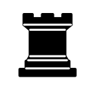
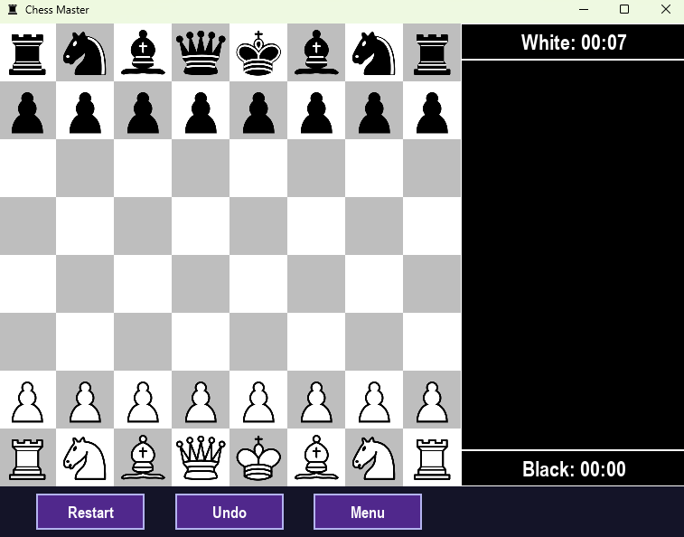
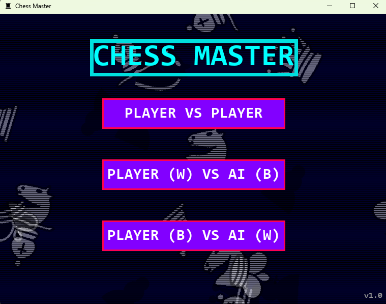

# Chess Master



A beautiful, feature-rich chess game built with Python and Pygame, offering both single and multiplayer modes with a retro-styled interface.

## ✨ Features

- 🎮 Multiple game modes:
  - Player vs Player
  - Player (White) vs AI (Black)
  - Player (Black) vs AI (White)
- 🖱️ Intuitive drag-and-drop pieces or traditional click-to-move
- 🏆 Checkmate and stalemate detection
- ⏱️ Game timing for both players
- 📜 Detailed move log with clear move notation
- 🔄 Game replay functionality to review completed games
- 👑 Pawn promotion with piece selection
- ↩️ Move undo capability
- 📏 Responsive design that adapts to window resizing

## 📸 Screenshots

### Game Board


*The main chess board with timers and control buttons*

### Main Menu


*Stylish retro-themed main menu with game mode selection*

## 🚀 Getting Started

### Prerequisites

- Python 3.6+
- Pygame library

### Installation

1. Clone the repository:
   ```bash
   git clone https://github.com/yourusername/chess-master.git
   cd chess-master
   ```

2. Install requirements:
   ```bash
   pip install pygame numpy
   ```

3. Run the game:
   ```bash
   python ChessMain.py
   ```

## 🎮 How to Play

1. **Launch the game** by running `ChessMain.py`
2. **Select a game mode** from the main menu:
   - Player vs Player
   - Player (White) vs AI (Black)
   - Player (Black) vs AI (White)
3. **Move pieces** by either:
   - Clicking a piece and then clicking its destination
   - Dragging a piece to its destination
4. **Use the control buttons** at the bottom of the screen:
   - **Restart**: Start a new game
   - **Undo**: Take back the last move
   - **Menu**: Return to the main menu

### Pawn Promotion

When a pawn reaches the opposite end of the board, a promotion menu will appear allowing you to choose which piece to promote the pawn to (Queen, Rook, Bishop, or Knight).

### Game End

When a game ends (checkmate or stalemate), you can:
- View the result
- Click the "REPLAY GAME" button to watch a replay of the entire game
- Start a new game by clicking any of the control buttons

## 🗂️ Project Structure

- `ChessMain.py` - Main game driver, handles UI and game loop
- `ChessEngine.py` - Core chess logic, rules, and move validation
- `ChessAI.py` - AI opponent implementation
- `images/` - Chess piece images and icons

## 🧠 AI Implementation

The AI uses a minimax algorithm with alpha-beta pruning to evaluate positions and find the best moves. The evaluation considers:

- Material advantage
- Piece positioning
- Mobility
- King safety

## 🛠️ Technical Details

- Built with Python and Pygame
- Uses NumPy for efficient board representation
- Multithreaded AI processing for smooth gameplay
- Responsive design adapts to different window sizes

## 🤝 Contributing

Contributions are welcome! Please feel free to submit a Pull Request.

1. Fork the repository
2. Create your feature branch (`git checkout -b feature/amazing-feature`)
3. Commit your changes (`git commit -m 'Add some amazing feature'`)
4. Push to the branch (`git push origin feature/amazing-feature`)
5. Open a Pull Request

## 🙏 Acknowledgments

- Chess piece images based on standard designs
- Chess algorithms inspired by traditional chess programming techniques
- Thanks to the Pygame community for their excellent documentation

---

*Made with Pygame by Shashi Bhushan Kumar* 